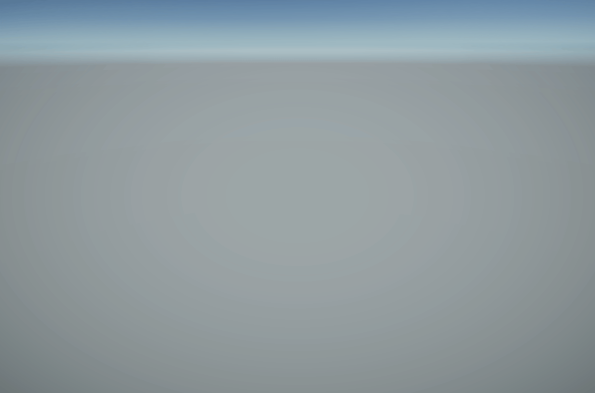
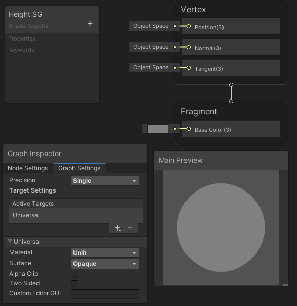

# 頂点の移動
頂点を動かし、適切にライティングを行います。

srcフォルダをUnityで開きます。

## 自分なりに変更した点
-
-
-

## 進め方

- 本リポジトリをフォークしてください
- フォークしたリポジトリをcloneします
- Unityのプロジェクトを更新して実装してください。
  - HeightSceneを開いてください
  - 結果画像1（1番上の画像）と同じシーンを実現してください
  - 結果画像2（2番目の画像）と同じシーンを実現してください
  - 結果画像3（3番目の画像）と同じシーンを実現してください
  - 自分なりにかっこいいシーンを作成してください
- かっこいいシーンをUnity Recorderで動画として保存し、result_a.gifと差し替えてください（サイズが大きくて上げられない場合は、解像度を小さくするなどして下さい）
- node_graph_a.pngを自分のシェーダグラフの一番頑張ったノードと差し替えてください
- このテキストファイルに変更点を記載してください

## 水シミュレーション

## 自分なりにかっこいいシーン

# 自分なりに変更した点
-
-
-

# 進め方

- 本リポジトリをフォークしてください
- フォークしたリポジトリをcloneします
- Unityのプロジェクトを更新して実装してください。
  - WaveSceneを開いてください
  - 結果画像4（1番上の画像）と同じシーンを実現してください
  - 結果画像5（2番目の画像）と同じシーンを実現してください
  - 結果画像6（3番目の画像）と同じシーンを実現してください
  - 自分なりにかっこいいシーンを作成してください
- かっこいいシーンの結果をUnity Recorderで動画として保存し、result_b.gifと差し替えてください（サイズが大きくて上げられない場合は、解像度を小さくするなどして下さい）
- node_graph_b.pngを自分のシェーダグラフの一番頑張ったノードと差し替えてください
- このテキストファイルに変更点を記載してください
- プルリクエストを出して提出してください
